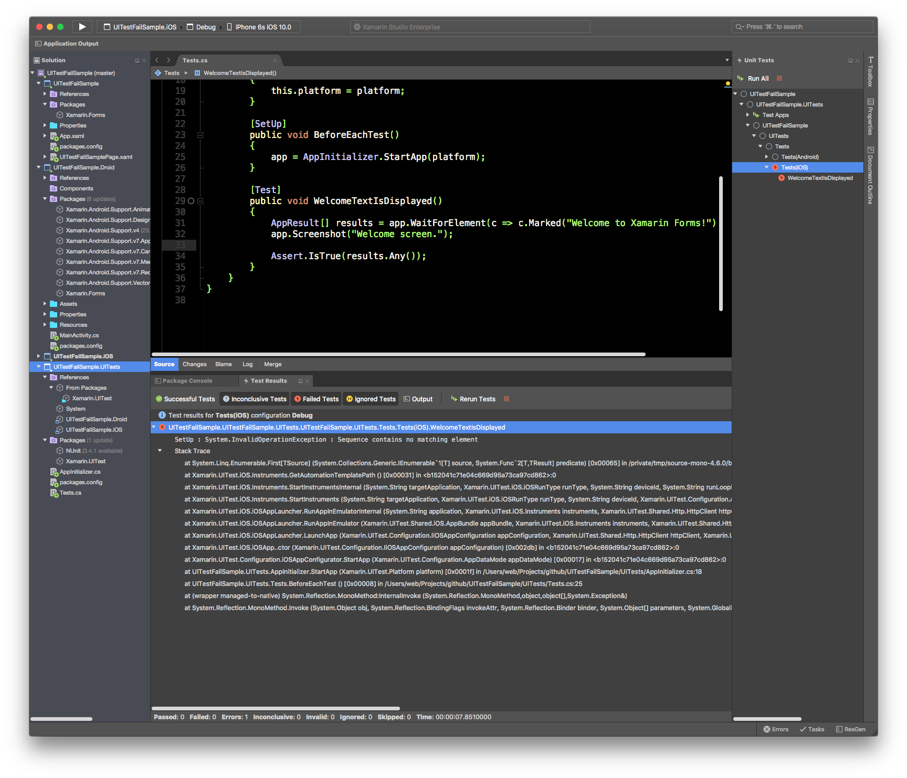

# UITestFailSample
Sample project demonstrating issue with running UITest on iOS 10 

After upgrading Xamarin Studio to Version 6.1 (build 5441)
running UITest fails with the following exception:

##Xamarin Studio screenshot

##Exception

SetUp : System.InvalidOperationException : Sequence contains no matching element
Stack trace:
  at System.Linq.Enumerable.First[TSource] (System.Collections.Generic.IEnumerable`1[T] source, System.Func`2[T,TResult] predicate) [0x00065] in /private/tmp/source-mono-4.6.0/bockbuild-xamarin/profiles/mono-mac-xamarin/build-root/mono-x86/mcs/class/referencesource/System.Core/System/Linq/Enumerable.cs:965 
  at Xamarin.UITest.iOS.Instruments.GetAutomationTemplatePath () [0x00031] in <b152041c71e04c669d95a73ca97cd862>:0 
  at Xamarin.UITest.iOS.Instruments.StartInstrumentsInternal (System.String targetApplication, Xamarin.UITest.iOS.iOSRunType runType, System.String deviceId, System.String runLoopPath, Xamarin.UITest.Configuration.AppDataMode appDataMode, System.Predicate`1[T] dropLine) [0x00006] in <b152041c71e04c669d95a73ca97cd862>:0 
  at Xamarin.UITest.iOS.Instruments.StartInstruments (System.String targetApplication, Xamarin.UITest.iOS.iOSRunType runType, System.String deviceId, Xamarin.UITest.Configuration.AppDataMode appDataMode) [0x00012] in <b152041c71e04c669d95a73ca97cd862>:0 
  at Xamarin.UITest.iOS.iOSAppLauncher.RunAppInEmulatorInternal (System.String application, Xamarin.UITest.iOS.Instruments instruments, Xamarin.UITest.Shared.Http.HttpClient httpClient, System.Uri deviceUri, Xamarin.UITest.Shared.Artifacts.ArtifactFolder artifactFolder, Xamarin.UITest.Configuration.AppDataMode appDataMode, System.String deviceIdentifier) [0x00095] in <b152041c71e04c669d95a73ca97cd862>:0 
  at Xamarin.UITest.iOS.iOSAppLauncher.RunAppInEmulator (Xamarin.UITest.Shared.iOS.AppBundle appBundle, Xamarin.UITest.iOS.Instruments instruments, Xamarin.UITest.Shared.Http.HttpClient httpClient, System.Uri deviceUri, Xamarin.UITest.Shared.Artifacts.ArtifactFolder artifactFolder, Xamarin.UITest.Configuration.AppDataMode appDataMode, System.String deviceIdentifier) [0x00099] in <b152041c71e04c669d95a73ca97cd862>:0 
  at Xamarin.UITest.iOS.iOSAppLauncher.LaunchApp (Xamarin.UITest.Configuration.IiOSAppConfiguration appConfiguration, Xamarin.UITest.Shared.Http.HttpClient httpClient, Xamarin.UITest.TestCloud.TestCloudiOSAppConfiguration testCloudAppConfiguration, Xamarin.UITest.Shared.Http.HttpClient testCloudWsClient) [0x000e4] in <b152041c71e04c669d95a73ca97cd862>:0 
  at Xamarin.UITest.iOS.iOSApp..ctor (Xamarin.UITest.Configuration.IiOSAppConfiguration appConfiguration) [0x002db] in <b152041c71e04c669d95a73ca97cd862>:0 
  at Xamarin.UITest.Configuration.iOSAppConfigurator.StartApp (Xamarin.UITest.Configuration.AppDataMode appDataMode) [0x00017] in <b152041c71e04c669d95a73ca97cd862>:0 
  at UITestFailSample.UITests.AppInitializer.StartApp (Xamarin.UITest.Platform platform) [0x0001f] in /Users/web/Projects/github/UITestFailSample/UITests/AppInitializer.cs:18 
  at UITestFailSample.UITests.Tests.BeforeEachTest () [0x00008] in /Users/web/Projects/github/UITestFailSample/UITests/Tests.cs:25 
  at (wrapper managed-to-native) System.Reflection.MonoMethod:InternalInvoke (System.Reflection.MonoMethod,object,object[],System.Exception&)
  at System.Reflection.MonoMethod.Invoke (System.Object obj, System.Reflection.BindingFlags invokeAttr, System.Reflection.Binder binder, System.Object[] parameters, System.Globalization.CultureInfo culture) [0x00038] in /private/tmp/source-mono-4.6.0/bockbuild-xamarin/profiles/mono-mac-xamarin/build-root/mono-x86/mcs/class/corlib/System.Reflection/MonoMethod.cs:305 
  
